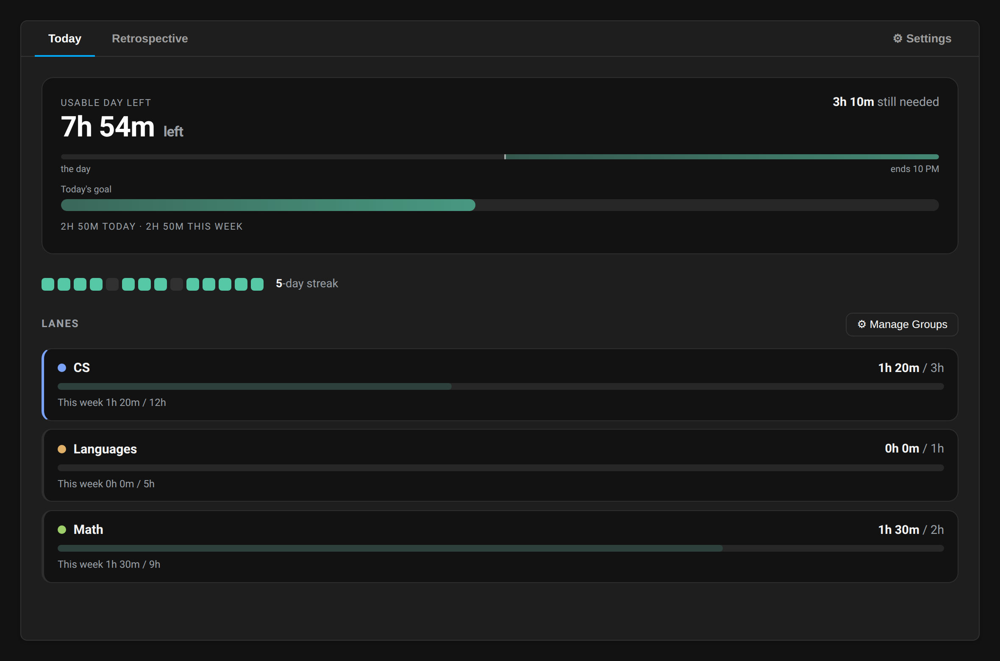
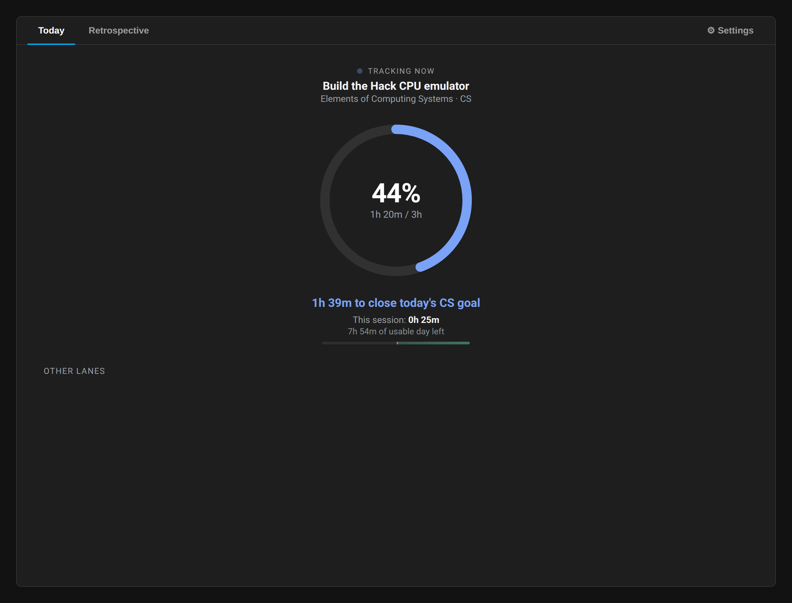
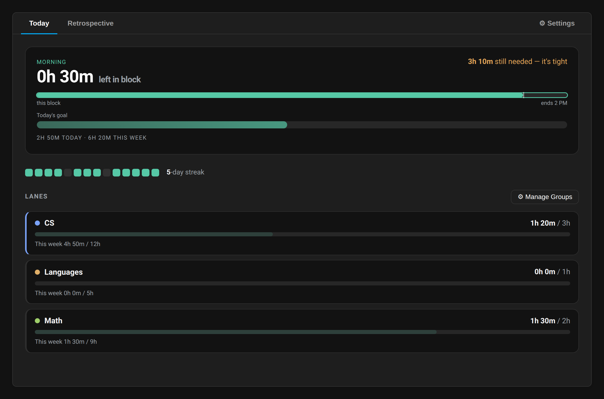

# Progress Dashboard

A [Super Productivity](https://super-productivity.com) plugin that helps you make steady, visible progress across your projects — measured in hours invested, and built for a brain that finds *starting* and *switching* hard.

---

## What it's for

Most trackers tell you what you did. That's a poor motivator when the hard part is executive function — starting a session, feeling time pass, not collapsing into "I'm too far behind to bother."

This dashboard is built for that brain (ADHD / autism). Its job is to help you put in **steady hours across several areas of work, day after day**, without nagging, shame, or a wall of red.

## The idea: an instrument, not a coach

It never tells you what to do. There's no "work on this now," no guilt, no manufactured urgency. Deciding what to switch to is exactly the expensive part, so it doesn't guess for you — a wrong nudge costs more than none.

Instead it does three quiet things: makes where you stand **legible in a glance**, makes the passing day **something you can feel**, and — once you start — **protects and rewards the session** you're in. Deep focus and a reluctance to switch are treated as strengths to guard, not habits to break.

## How it works: two modes

The **Today** view is one of two screens, depending on whether a timer is running. You never choose — it follows what you're already doing.

### Launchpad — when you're deciding

Your day is drawn as the **work blocks you actually keep** — a hard morning, an easier afternoon, whatever shape fits you — and the bar counts down the *current* block, not some far-off end of day. A distant deadline is invisible to a time-blind brain; the end of the block you're in is not. Between blocks it pauses on a guilt-free break, and each block can be marked *hard* or *easy* so the harder work carries more weight. Below it, a streak of recent days; then calm **lanes** (your grouped areas of work) showing today against a daily goal. Only the lane you're furthest behind on gets a quiet accent — everything else stays quiet. No decision is made for you; the point is to make *your* decision fast.

### Focus — when you're working

Start a timer and everything collapses to one thing: a ring closing that lane's goal for the day, filling as you work. A shrinking "time to close the goal," how deep you are into the session, and a small gauge of the current block. Hit the goal and it says *keep rolling*, never *stop* — the aim is depth, not clocking out.

## Calm by design

One focal point at a time, a stable layout that never rearranges, and motion you can switch off. Colour carries meaning sparingly: the single warm cue appears only when a **hard** block is genuinely running out of time for the goal — and it stays silent through your easy blocks, where pressure would only manufacture guilt. So when it shows, it still means something.

## Every state

The screenshots above are the gist. The rest — goal met, day over, an unplanned session, the weekly retrospective, and settings — live in [`screenshots/`](screenshots/).

## Install

Download the latest [release](https://github.com/Raian256/sp-progress-dashboard/releases), then in Super Productivity go to **Settings → Plugins → Load Plugin from Folder** and pick the zip.

---

Everything runs inside Super Productivity as a single self-contained file, with no external dependencies. Development and build notes live in [`CLAUDE.md`](CLAUDE.md).
